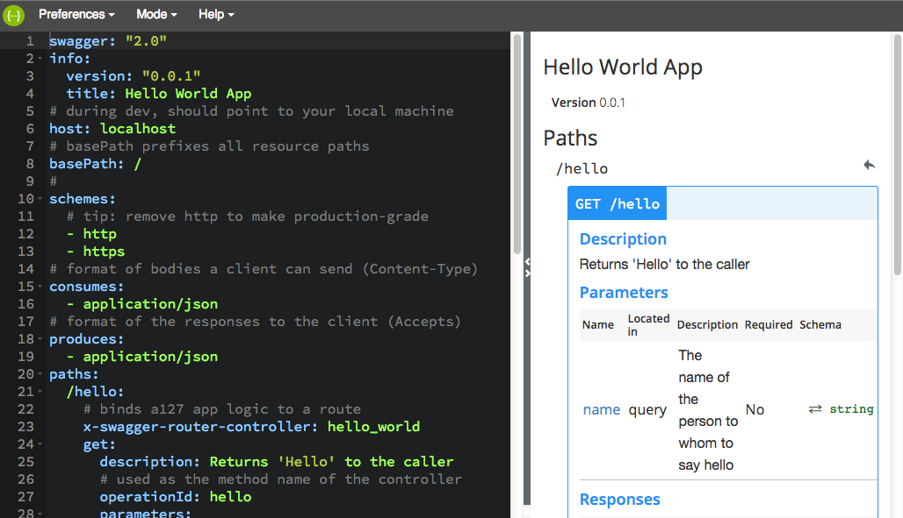

## Quick start

Let's see how easily and quickly you can get a simple API up and running using swagger-node.

* [Get an API up and running](#upandrunning)
* [Check out the main Node.js app file](#main)
* [Open the Swagger editor](#openeditor)
* [Windows users](#windows)

### <a name="upandrunning"></a>Get an API up and running

First, we create a new swagger-node project and test a simple "hello world" API.

1. Install swagger-node, as described in the [installation guide](install.md).

2. Create swagger-node project directory and cd to it. This is where you'll create your first project. 

3. Execute the project create command: 

    `swagger project create hello-world`

4. Pick the API framework you want to use. We're going to pick express, but you can pick any of the listed frameworks:
    ```
    ? Framework? (Use arrow keys)
      connect
    ❯ express
      hapi
      restify
      sails
    ```
5. swagger-node clones a skeleton project from GitHub that's pre-configured to use your selected framework (in this example, Express). It then runs `npm install` to pick up the dependencies.  

>Note: Windows users see the [note below](#windows-note) regarding npm. 

6. Change to the new project directory: `cd hello-world`

7. Type `swagger project start` to start your API.  You now have an API running with swagger-node!

8. In another terminal, run this command: 

    `curl http://127.0.0.1:10010/hello?name=Scott`  

    And, you'll get back the response `Hello, Scott`.

That's it - You have now created, started and tested your first API project with swagger-node! 

### <a name="main"></a>Check out the main Node.js app file

Open <project-root>/app.js in an editor. This is the main Node.js app that installs middleware and requires the API framework that you chose when you created your project.

The middleware modules perform tasks like Swagger specification validation and endpoint routing. For more information, see [swagger-node modules and dependencies](./modules.md).

### <a name="openeditor"></a>Open the Swagger editor

The Swagger editor lets you design and test your API interactively. While you design and test, the API documentation is generated automatically for you. 

Now that we've got our basic API running, let's open the Swagger editor.

1. Be sure you're in your project root directory: `./hello-world`. 
 
2. Fire up the editor: `swagger project edit`

*The Swagger editor*



### <a name='windows'></a>Windows users
For some versions of npm on Windows will have problems on the `npm install` step of `swagger project create`.  They are related to a `debug` module on npm not being managed properly.  The following steps should resolve this issue:

1. In the project directory, execute the following commands:
  1. `npm install yamljs`
  2. `npm install debug`
  3. `npm install swagger-tools`

Now, when you run `swagger project start` your project should start successfully.
